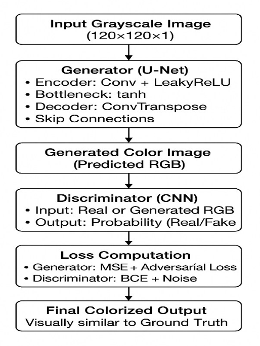

# 🎨 Image Colorization Using GANs

## Overview
A Deep Learning project that uses **Generative Adversarial Networks (GANs)** to automatically convert grayscale images into realistic and vibrant color images.

## Tech Stack
- Python
- TensorFlow / Keras
- NumPy
- Pillow (PIL)
- Google Colab

## Dataset

🔗 [Kaggle Image Colorization Dataset](https://www.kaggle.com/datasets/aayush9753/image-colorization-dataset/data)

## Model Architecture

- U-Net based Generator
- CNN-based Discriminator
- Input: Grayscale Image (120×120×1)
- Output: RGB Image (120×120×3)

## Results
The model generates realistic and context-aware colorized images while preserving structural details and textures.

## Conclusion
This project demonstrates the effectiveness of GANs for automatic image colorization, producing visually appealing and semantically meaningful results from grayscale inputs.

---
📄 For detailed methodology, implementation, experimental results, and analysis, please refer to the project report PDF.